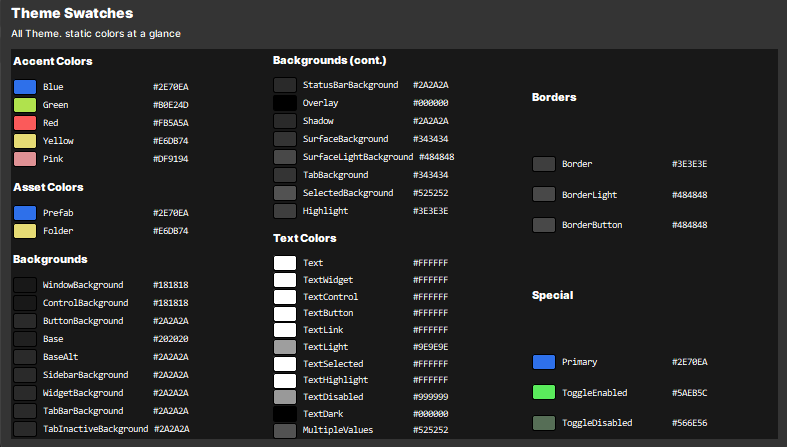
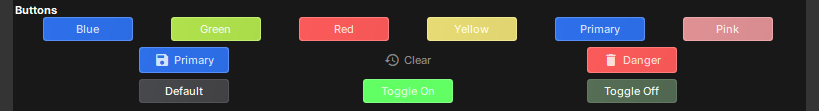

# Editor Theme

`Theme` is a static class in the `Editor` namespace that provides access to the editor's colors, fonts, and layout. All values are loaded from `/addons/tools/assets/styles/theme.json` at startup — users can customize them, and your tools automatically follow suit.

Use `Theme.X` anywhere in your editor widgets to stay consistent with the editor's look and feel.



# Accent Colors

Semantic colors for syntax highlighting, status indicators, and emphasis.

| Static         | Default   | Usage                       |
| -------------- | --------- | --------------------------- |
| `Theme.Blue`   | `#3273EB` | Types, links, info          |
| `Theme.Green`  | `#B0E24D` | Success, component names    |
| `Theme.Red`    | `#FB5A5A` | Errors, destructive actions |
| `Theme.Yellow` | `#E6DB74` | Warnings, read-only markers |
| `Theme.Pink`   | `#DF9194` | Accent, misc highlights     |

```csharp
_body.AppendHtml( $"<span style=\"color: {Theme.Green};\">{type.Name}</span>" );
_body.AppendHtml( $"<span style=\"color: {Theme.Yellow};\">🔒</span>" );
```

# Asset Colors

Colors used in the Asset Browser and file pickers.

| Static         | Default   | Usage             |
| -------------- | --------- | ----------------- |
| `Theme.Prefab` | `#3273EB` | Prefab file icons |
| `Theme.Folder` | `#E6DB74` | Folder icons      |

# Background Colors

Surfaces and containers, layered from deepest to highest.

| Static                         | Default   | Usage                               |
| ------------------------------ | --------- | ----------------------------------- |
| `Theme.WindowBackground`       | `#181818` | Main editor window                  |
| `Theme.ControlBackground`      | `#181818` | Text inputs, text edits, controls   |
| `Theme.ButtonBackground`       | `#181818` | Button surfaces                     |
| `Theme.Base`                   | `#202020` | Base panel background               |
| `Theme.BaseAlt`                | `#242424` | Alternating row / base variant      |
| `Theme.SidebarBackground`      | `#242424` | Sidebar panels (Project, Inspector) |
| `Theme.WidgetBackground`       | `#242424` | Generic widget background           |
| `Theme.TabBarBackground`       | `#242424` | Tab bar strip                       |
| `Theme.TabInactiveBackground`  | `#242424` | Inactive tab                        |
| `Theme.StatusBarBackground`    | `#242424` | Bottom status bar                   |
| `Theme.Overlay`                | `#242424` | Modal / overlay backdrop            |
| `Theme.Shadow`                 | `#242424` | Drop shadow color                   |
| `Theme.SurfaceBackground`      | `#3b3b3b` | Elevated surfaces, tooltips, menus  |
| `Theme.SurfaceLightBackground` | `#696969` | Lighter surface variant             |
| `Theme.TabBackground`          | `#3b3b3b` | Active tab                          |
| `Theme.SelectedBackground`     | `#808080` | Selection highlight                 |
| `Theme.Highlight`              | `#9E9E9E` | Hover highlight                     |

```csharp
// Common pattern: panel = ControlBackground, text = TextWidget
SetStyles( $"background-color: {Theme.ControlBackground}; color: {Theme.TextWidget};" );
```

# Text Colors

All text variants, from primary content to disabled labels.

| Static                 | Default     | Usage                                     |
| ---------------------- | ----------- | ----------------------------------------- |
| `Theme.Text`           | `#FFFFFF`   | Primary text                              |
| `Theme.TextWidget`     | `#FFFFFF`   | Widget content text                       |
| `Theme.TextControl`    | `#FFFFFF`   | Text inside controls (TextEdit, LineEdit) |
| `Theme.TextButton`     | `#FFFFFF`   | Button label text                         |
| `Theme.TextLink`       | `#FFFFFF`   | Hyperlinks                                |
| `Theme.TextLight`      | `#9E9E9E`   | Subdued / secondary text                  |
| `Theme.TextSelected`   | `#66a3ff`   | Selected text                             |
| `Theme.TextHighlight`  | `#66a3ff`   | Highlighted text (search matches)         |
| `Theme.TextDisabled`   | `#FFFFFF55` | Disabled / greyed-out text                |
| `Theme.TextDark`       | `#000000`   | Dark text (for light surfaces)            |
| `Theme.MultipleValues` | `#808080`   | "Multiple values" indicator in Inspector  |

```csharp
// Labels — use the native Color property (calls SetStyles internally)
label.Color = Theme.TextWidget;

// Subdued secondary text
hint.Color = Theme.TextLight;
```

# Border Colors

Edge and separator lines.

| Static               | Default   | Usage                      |
| -------------------- | --------- | -------------------------- |
| `Theme.Border`       | `#525252` | Standard border            |
| `Theme.BorderLight`  | `#696969` | Lighter border / separator |
| `Theme.BorderButton` | `#696969` | Button border              |

# Special Colors

Miscellaneous purpose-driven colors.

| Static                 | Default   | Usage                        |
| ---------------------- | --------- | ---------------------------- |
| `Theme.Primary`        | `#5a8deb` | Primary brand / accent color |
| `Theme.ToggleEnabled`  | `#5aeb5c` | Toggle ON state              |
| `Theme.ToggleDisabled` | `#566e56` | Toggle OFF state             |

# Layout

| Static                | Type    | Default | Usage                        |
| --------------------- | ------- | ------- | ---------------------------- |
| `Theme.ControlRadius` | `float` | `3`     | Border radius for controls   |
| `Theme.ControlHeight` | `float` | `18`    | Standard control height (px) |
| `Theme.RowHeight`     | `float` | `16`    | Standard row height (px)     |

```csharp
// Use in custom paint / layout calculations
var h = Theme.RowHeight;
var r = Theme.ControlRadius;
```

# Fonts

| Static                | Usage                      |
| --------------------- | -------------------------- |
| `Theme.DefaultFont`   | Body text, labels, buttons |
| `Theme.HeadingFont`   | Section headings           |
| `Theme.MonospaceFont` | Code, console output       |

```csharp
label.SetStyles( $"font-family: {Theme.HeadingFont};" );
```

# How to Apply Colors

Different widgets use different mechanisms — know which one to use.

| Widget           | Mechanism                         | Example                                                                 |
| ---------------- | --------------------------------- | ----------------------------------------------------------------------- |
| `Label`          | `label.Color` property            | `label.Color = Theme.TextWidget;`                                       |
| `Button`         | `btn.Tint` property               | `btn.Tint = Theme.Primary;`                                             |
| `Widget` (base)  | `SetStyles` CSS                   | `SetStyles($"background-color: {Theme.ControlBackground};")`            |
| `TextEdit` HTML  | Inline `<span style="color:...">` | `_body.AppendHtml($"<span style=\"color: {Theme.Blue};\">int</span>");` |
| `Paint` (custom) | `Paint.SetPen` / `Paint.SetBrush` | `Paint.SetBrush(Theme.ControlBackground);`                              |

:::info
**Button** and **Label** are native Qt widgets. Their colors are controlled by native properties (`Tint`, `Color`), not CSS `SetStyles`. Using `SetStyles("background-color: ...")` on a Button has no effect.
:::



# Quick Reference

```csharp
// Standard panel (base Widget)
SetStyles( $"background-color: {Theme.ControlBackground}; color: {Theme.TextWidget};" );

// Label text
label.Color = Theme.TextWidget;
label.SetStyles( "font-size: 11px;" );

// Tinted button
btn.Tint = Theme.Primary;

// Pre-styled button variants
var saveBtn = new Button.Primary( "Save", "save" );
var undoBtn = new Button.Clear( "Undo", "history" );
var delBtn  = new Button.Danger( "Delete", "delete" );

// HTML body with color-coded content (TextEdit.AppendHtml)
_body.AppendHtml( $"<span style=\"color: {Theme.Blue};\">int</span>" );
_body.AppendHtml( $"<span style=\"color: {Theme.Green};\">ComponentName</span>" );
_body.AppendHtml( $"<span style=\"color: {Theme.Yellow};\">🔒</span>" );
_body.AppendHtml( $"<span style=\"color: {Theme.TextWidget};\">propertyName</span>" );

// Custom painted widget (OnPaint override)
Paint.SetBrush( Theme.ControlBackground );
Paint.DrawRect( LocalRect, Theme.ControlRadius );
Paint.SetPen( Theme.TextWidget );
Paint.DrawText( LocalRect, "Hello", TextFlag.Center );
```
