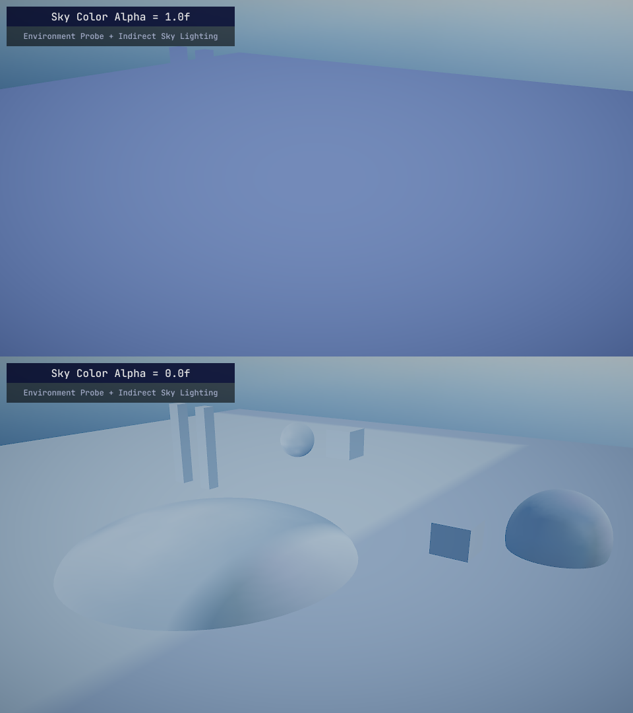

# Ambient Light

This class is part of the standard shading model, which allows fetching proper diffuse light contribution from appropriate sources on scene.

## From

```cpp
AmbientLight::From( float3 WorldPosition, float4 PositionSs, float3 WorldNormal )

```
* `WorldPosition`: world-space pixel position, can get it with `i.vPositionWithOffsetWs` + `g_vCameraPositionWs`
* `PositionSs`: screen-space position data, `i.vPositionSs` in standard pixel input struct
* `WorldNormal`: world-space geometry normals 

This method will return diffuse ambient light from one of the sources on scene in current order of priority:

1. Indirect Light Volume (DDGI)
2. Sky Color (directional light, controlled by alpha)
3. Environment Probe/Sky Indirect Lighting (2D Skybox)
4. Lightmap Probes

For example, if you have directional light *and* environment probe set up, `::From` will return flat sky color first, which visibility can be controlled by adjusting the alpha. Set the sky color alpha to zero (or anything inbetween) to make envprobes/indirect sky lighting more visible. Everything outside environment probes will draw indirect sky lighting from 2D Skybox.



If there is indirect light volume present on scene, then `::From` will always return it first. You can also sample different types of diffuse light sources separately using following functions below:

## FromDDGI

Samples ambient light produced by **Indirect Light Volume**. If you don't have this component on scene, and it hasn't been baked yet, this will return **0**. Everything outside of the volume (even when baked) will be always **0** too. 

```cpp
AmbientLight::FromDDGI( float3 WorldPosition, float3 WorldNormal )

```

## FromEnvMapProbe

Samples ambient light from **Environment Probe**, **Indirect Sky Lighting** (2D Skybox) or **Sky Color** (Directional Light). Read the explanation in `::From` section to see how exactly AmbientLight class selects the light source for sampling. 

```cpp
AmbientLight::FromEnvMapProbe( float3 WorldPosition, float4 PositionSs, float3 WorldNormal )

```

## FromLightMapProbe

This will draw ambient light produced from lightmap probes.

```cpp
AmbientLight::FromLightMapProbeVolume( float3 WorldPosition, float3 WorldNormal )
```