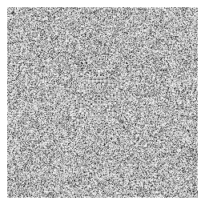
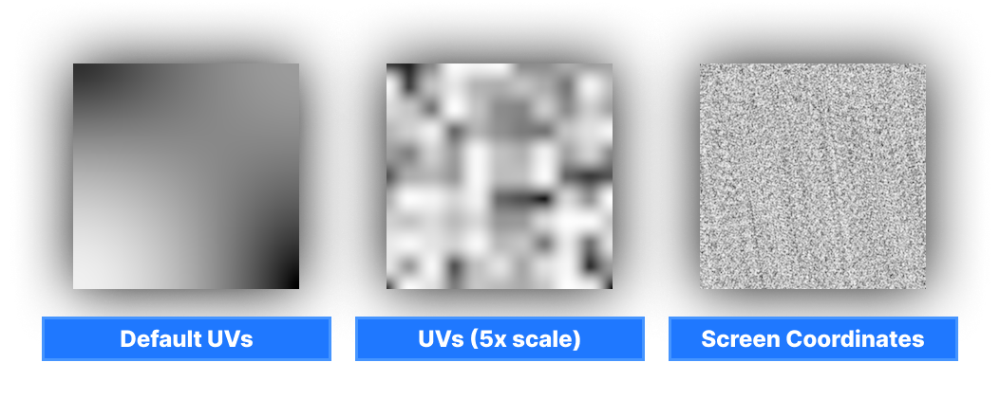
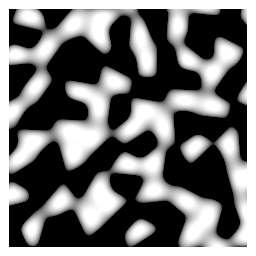
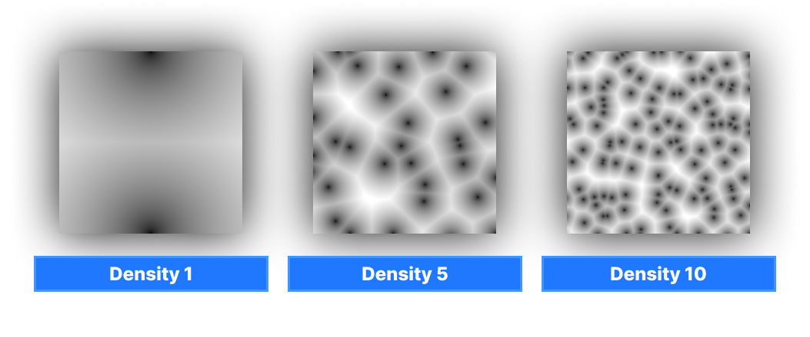
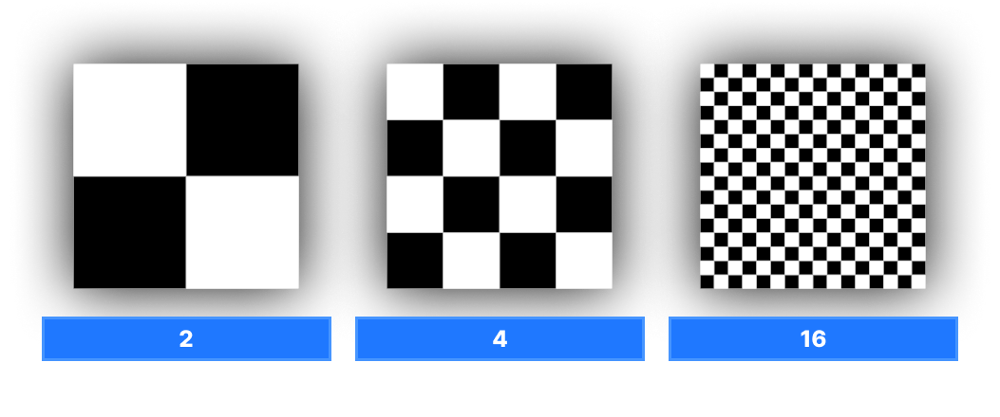
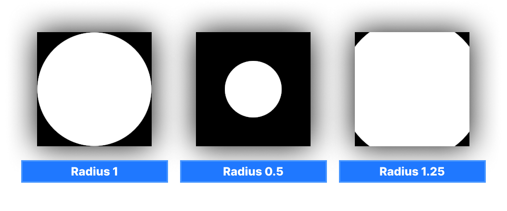
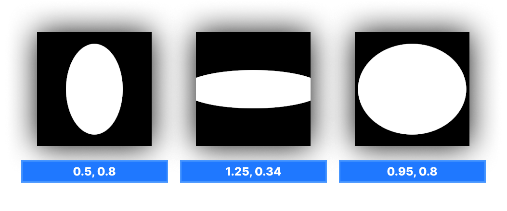
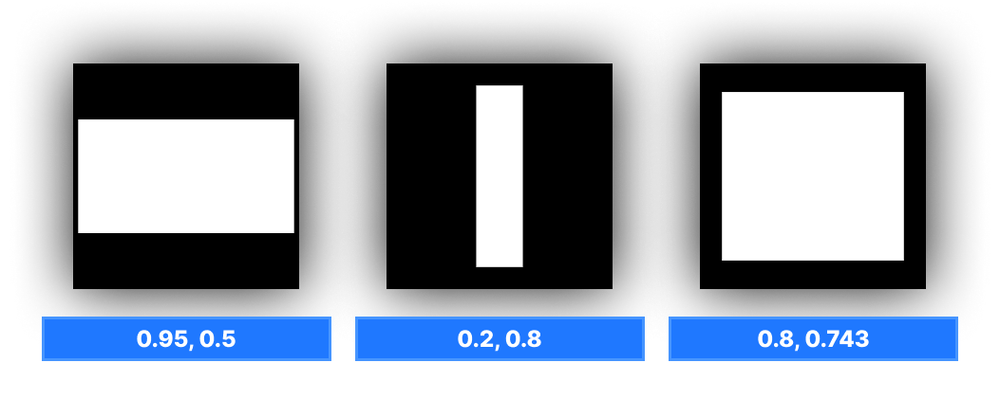
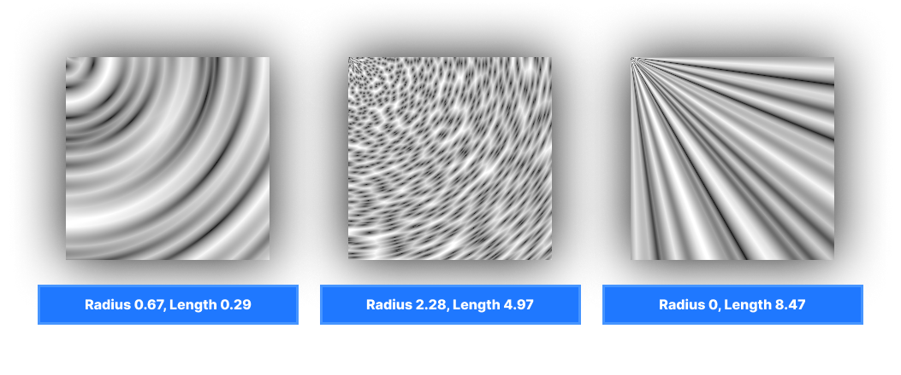

# Procedural Effects

:::tip
Unlike other classes, `procedural.hlsl` is located directly at the Shader folder root and simply provides a collection of various helper functions, it isn't a proper class. It does not come included in your shader by default, and must be manually imported by adding `#include "procedural.hlsl"` to your code.

:::

`procedural.hlsl` is a file that contains a bunch of helper functions: procedural noises, shapes, and some UV utilities. They can be used for any purpose, just get any UV coordinates (like `i.vTextureCoords.xy`, `i.vPositionSs.xy` or anything else) and adjust any additional parameters to get desired effect.

## Fuzzy Noise

Very simple and cheap type of "TV static" noise. 

* `float`: `FuzzyNoise( float2 UV, float2 Dot = float2( 12.9898f, 78.233f ) )`
* * `Dot` is optional. Inside the noise function, it calculates the dot product between these two values, which is used as a seed for the final noise value. You can use any values in here, like `g_flTime` or anything else to control/animate the noise.

* `float2`: `FuzzyNoise2D( float2 UV )`
* * Produces same noise, except it stores two random fuzzy noise values in a `float2` vector. You cannot control the dot value in this one. 

* `float2`: `FuzzyNoiseWithOffset( float2 UV, float Offset )`
* * Generated the same noise as `FuzzyNoise2D`, except you can control the final noise value by providing an offset value, which can look smoother/less harsh to your eye if you animate it. 

## Value Noise

It's similar to fuzzy noise, but it is smoother and can react to different UV scales, which is something that you can't really do properly with fuzzy noise.

* `float`: `ValueNoise( float2 UV )`

## Simplex 2D

Generates [simplex noise](https://en.wikipedia.org/wiki/Simplex_noise). Unlike other noises above, this one returns the value in (-1 to 1) range.

* `float`: `Simplex2D( float2 UV )`

## Voronoi Noise

Generates [voronoi noise](https://en.wikipedia.org/wiki/Worley_noise). 

* `float`: `VoronoiNoise( float2 UV, float AngleOffset, float Density )`
* * `AngleOffset` controls the positioning of cells in this noise. Can be animated with `g_flTime`.
* * `Density` controls the "scale" of final noise texture.

# Procedural Shapes

This file also comes with a number of procedural pattern functions. 

## Checkerboard

Generates simple black-and-white checkerboard pattern and properly anti-aliased.

* `float`: `Checkboard( float2 UV, float Frequency )`
* * `Frequency` controls the amount of checkerboards on UV.

## Circle

Draws a circle on UV, aligned at center of UV.

* `float`: `Circle( float2 UV, float Size )`
* * `Size` controls the size of this circle. `1` = covers whole UV, `0` = invisible (too small)

## Ellipse

Draws an ellipse on UV, aligned at center of UV. Can adjust the size on both axis.

* `float`: `Ellipse( float2 UV, float2 Size )`
* * `Size` takes the **float2** vector to control the size of this ellipse on both dimensions.

## Square

Draws a square on UV, aligned at center of UV.

* `float`: `Square( float2 UV, float Size )`
* * `Size` controls the size of this square. `1` = covers whole UV, `0` = invisible (too small)

## Rectangle

Draws a rectangle on UV, aligned at center of UV. Can adjust the size on both axis.

* `float`: `Rect( float2 UV, float2 Size )`
* * `Size` takes the **float2** vector to control the size of this rectangle on both dimensions.

# UV Helpers

There are a few UV helpers as well. 

## Tile

* `float2`: `TileUV( float2 UV, float2 Tile )`
* * `Tile` takes the **float2** vector to control how many times the given UV must be tiled on both axis

This helper simply multiples `UV` by `Tile` value.

## Offset

* `float2`: `OffsetUV( float2 UV, float2 Amount )`
* * `Amount` takes the **float2** vector to control the direction & amount of UV offset. 

This helper simply does `UV + Amount`.

## Tile and Offset

Handles both tiling and offseting at the same time. 

* `float2`: `TileAndOffsetUV( float2 UV, float2 Tile, float2 Offset )`
* * `Tile` takes the **float2** vector to control how many times the given UV must be tiled on both axis
* * `Amount` takes the **float2** vector to control the direction & amount of UV offset. 

## Polar Coordinates

Convers standard UVs to polar coordinates.

* `float2`: `PolarCoordinates( float2 UV, float RadiusScale, float LengthScale )`

Here's a bunch of examples where **voronoi noise** is sampled with polar coordinates:

